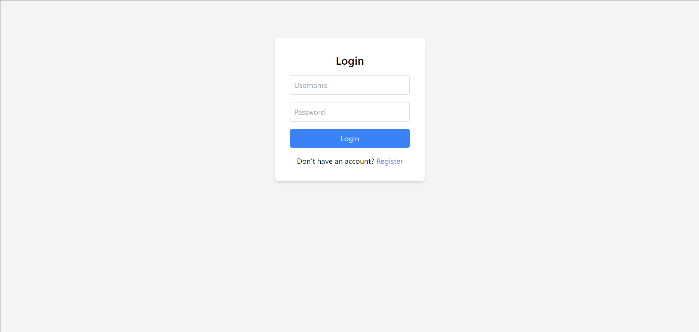

# Simple Login Authentication System

This is a simple login authentication system built using HTML, CSS (Tailwind), and JavaScript. The system allows users to register, login, and access a secured page. The registered users are stored in the browser's `localStorage`, and session management is handled via `sessionStorage`.

## Features

- **Register**: New users can create an account with a username and password.
- **Login**: Registered users can log in with their username and password.
- **Secured Page**: After successful login, users are redirected to a secured page where they can view exclusive content.
- **Logout**: Logged-in users can log out, clearing their session and returning to the login page.
- **Persistent Users**: Registered users are saved across sessions in `localStorage`.

## Technologies Used

- **HTML**: For the structure and layout of the pages.
- **CSS**: Tailwind CSS for styling and responsiveness.
- **JavaScript**: For the authentication logic and session management.
- **localStorage**: To store registered users across sessions.
- **sessionStorage**: To manage login sessions during a browser/tab session.

## How to Run

1. Clone the repository.
   
   ```bash
   Download this Folder.

2. Open the `index.html` file in your web browser. You can simply double-click on it to open it in the browser.

3. The application will run in your browser. You can register a new user, log in, and access the secured page.

## Features Walkthrough

1. Register Page:

    - Enter a username and password to register.
    - If the username already exists, an alert will notify the user.
    - Upon successful registration, the user will be redirected to the login page.

2. Login Page:

    - Enter the username and password.
    - If the credentials match a registered user, the user will be logged in and redirected to the secured page.

3. Secured Page:

    - Once logged in, the user is granted access to a secured page.
    - The user can log out at any time, which will clear their session and take them back to the login page.

4. Logout:

    - The user can log out using the Logout button, which clears the session and redirects back to the login page.

## Future Enhancements
- **Password Hashing:** Implement password hashing for secure storage (e.g., using bcrypt).
- **Backend Integration:** Store users in a database and integrate with a backend to handle authentication securely.
- **Error Handling:** Add better error handling, such as informing the user if the input is incorrect or empty.
- **Styling:** Further styling of the pages with more advanced Tailwind CSS features.

## Screenshot



## Author

- [Vedant Deshpande](https://github.com/vmDeshpande)