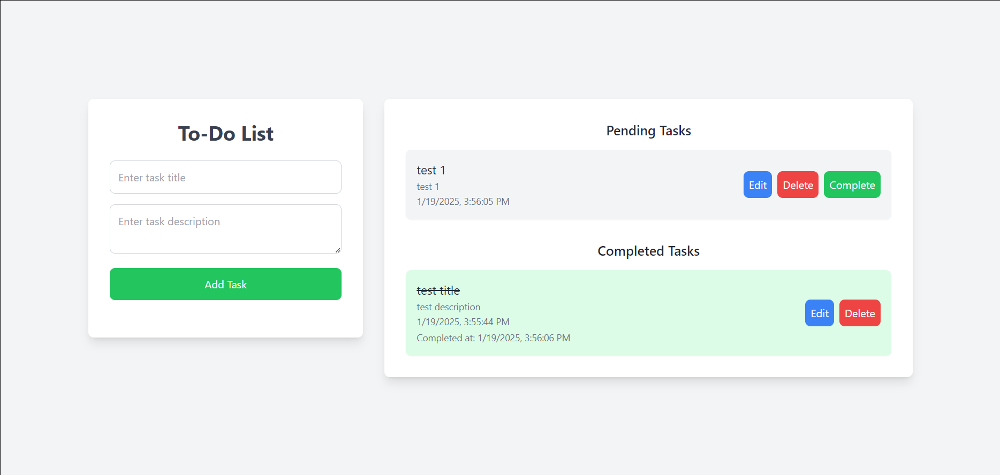

# To-Do List Web App

A simple to-do list web application that allows users to add tasks with a title and description, mark them as completed, and view the tasks in separate lists for pending and completed tasks. The tasks are persisted in `localStorage`, so they remain even after the page is reloaded.

## Features

- **Add Tasks**: Allows the user to add tasks with both a title and a description.
- **Mark Tasks as Completed**: Tasks can be marked as completed and will be moved to a separate list.
- **Edit Tasks**: Users can edit the description of tasks.
- **Delete Tasks**: Users can delete tasks from either the Pending or Completed list.
- **Persistent Data**: Tasks are saved in the browser's `localStorage`, so the data remains even after a page refresh.
- **Responsive UI**: Built with Tailwind CSS to ensure a clean and responsive user interface.

## Tech Stack

- **HTML**: Structure of the web app.
- **CSS**: Tailwind CSS for styling.
- **JavaScript**: Handles logic for adding, editing, deleting, and marking tasks as complete. Manages localStorage for task persistence.

## Setup Instructions

To run this project locally:

1. **Clone the repository**:

    ```bash
    git clone https://github.com/yourusername/todo-list-app.git
    ```

2. **Navigate to the project directory**:

    ```bash
    cd todo-list-app
    ```

3. **Open the `index.html` file** in your browser to see the application in action.

    Simply double-click on `index.html`, and it should open in your default browser.


## How to Use

1. **Add a Task**:
    - Enter a task title and description in the input fields on the left side.
    - Click the "Add Task" button to add the task to the Pending Tasks list.
    
2. **Complete a Task**:
    - Click the "Complete" button next to a task in the Pending Tasks list to mark it as completed.
    - Completed tasks will move to the Completed Tasks list.

3. **Edit a Task**:
    - Click the "Edit" button next to a task to edit its description.

4. **Delete a Task**:
    - Click the "Delete" button next to a task to remove it from the list.

5. **Persistent Data**:
    - Tasks will remain in the Pending or Completed lists even after you reload the page due to `localStorage` functionality.


## Screenshot



## Author

- [Vedant Deshpande](https://github.com/vmDeshpande)
